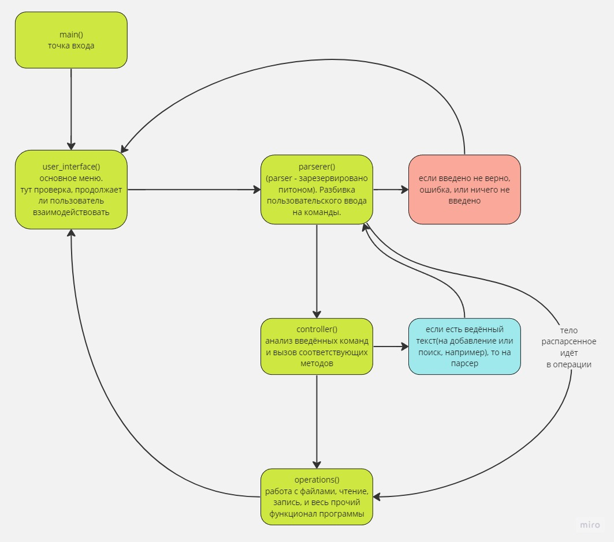

# Промежуточная контрольная работа по блоку специализация

## Консольное приложение для заметок

### [Задание](./TASK.md)

*15.09.2023*

Базовый (и даже больше) функционал готов. Все поставленные задачи программа выполняет. Осталось немного причесать код. В целом, старался именовать все переменные и функции так, что бы код читался легко, как обычный текст. Однако, очень уж много всего получилось, понимаю, что задачу, можно было бы выполнить строчек в 50-60. Приложил простенькую схему взаимодействия между модулями программы:  

Что стало ясно:
* с json я пока на "вы". Хочется напрямую взаимодействовать с файлом, а не через список-прокладку. Надо учить
* надо упрощать код, особенно, в пайтоне. Есть много конструкций, позволяющих в несколько раз сократить сложные конструкции. Да и логика, кажется, перемудрённая получилась.
* сначала стоит сделать mvp, а уже потом генерировать миллионы прекраснейших идей, которые **ну обязательно** необходимо реализовать. Легко закопаться и вообще не продвинуться. 
* но! что бы так делать, надо с самого начала выбирать правильную архитектуру, что бы была возможность расширять функционал программы, иначе приходится всё заново переписывать. Необходимо глубоко изучить этот вопрос.

*13.09.2023*

* добавил парсер команд , строк и айдишника. Проверяем, соответственно, корректность введённой команды, существование айдишника и обработка тела заметки. Если юзер пишет только тело, то заголовок автоматически составляется из првых трёх слов заметки (или из всей заметки если слов меньше трёх).  
* добавил работу с json файлом, пока есть создание, чтение и запись (во временный list, хранящийся в оперативной памяти)
* пропработал файл controller.py - он получает команду и строку и дальше уже решает , что делать, например, выбрать соответсвующую операцию из файла operations.py. Или же запросить у юзера дополнительную инфу, или же собщить ему о некорректном вводе.
* пока решил отказаться от многострочного ввода заметки с сохранением времени каждой строки, а то зарываться начинаю, желание новых типа-фич появляется раньше, чем успеваю сделать прошлые идеи 
* из операций реализовал добавление и удаление заметок (остался поиск по слову, чтение по айдишнику и редактирование по айдишнику)

на будущее идеи:  
сделать logger.py, может , в нем ххранить время всех изменений??  
checker.py - для проверки корректности ввода. хз, нужно ли заморачиваться отдельным модулем...     
загружать не весь json файл с телом заметок, а только id и title

*09.09.2023*

Сделал туду, добавил описание команд, сделал вызов помощи (возможно, тоже в операции перенесу)

##### ТУДУ

* проработать архитектуру
* создать файлы пустышки
* накидать в маин вызов юи
* добавить гитигнор

Архитектура:

* маин - вызов файла юзер интерфейс
* юзер интерфейс - список команд, хелп и ожидатель следующей команды
* контроллер - перенаправлятель куда следует, обработка введеных команд
* обработчик - все операции - здесь

Рад этому заданию. Давно хотел для себя сделать приложение с заметками с одной очень важной для меня фичей - на каждую новую строку ставится временная отметка. Так, в стандартных заметках, как правило, сохраняется только время последнего изменения, иногда ещё и время создания. А запись может быть достаточно большой и их тоже может быть много. Хотелось бы понимания что и когда была вресено. Или, другой вариант: начал писать сегодня , а продолжил завтра (хотя , для консольного приложения это трудновато представить, а вот для заметок в телефоне очень бы хотелось видеть такую функцию).